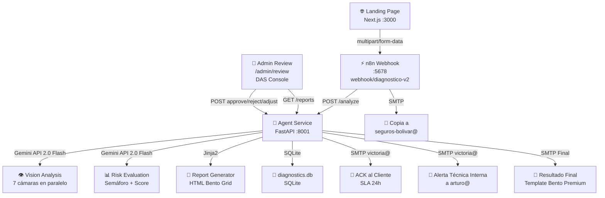

# 📘 SDD: SafetyMind Diagnostic Automation Suite (V4.3)

> Última actualización: 2026-05-12

## 1. Resumen Ejecutivo

El **Diagnostic Automation Suite (DAS)** es una plataforma semi-automatizada de preventa técnica para Seguros Bolívar. Permite a clientes realizar un "Autodiagnóstico de Viabilidad Técnica" antes de implementar el servicio de videoanalítica de SafetyMind.

**Metas principales (Arc42):**
1. Facilitar la recolección de información técnica de infraestructura del cliente (VPN, Servidor, Operación 24/7, Refrigeración, Iluminación).
2. Facilitar la subida de fotografías de validación (7 cámaras) para que la IA (Gemini 2.0 Flash) y/o un especialista técnico verifiquen la viabilidad del tamaño en píxeles y calidad de imagen.
3. Reducir la fricción en la cualificación de clientes, enviando un resultado tipo Semáforo (Verde, Amarillo, Rojo).
4. Proveer un SLA máximo de 1 día hábil para la respuesta.

## 2. Restricciones de Arquitectura (Arc42)

| # | Restricción | Estado |
|---|-------------|--------|
| 1 | **Capa de Entrada:** Interfaz de usuario (Landing page/Wizard Next.js) atractiva (Bento Grid) para captura de respuestas e imágenes | ✅ Implementado |
| 2 | **Flujo Semi-Automático (HITL):** Validación manual por un técnico (SafetyMind) o asistida por IA (Gemini 2.0 Flash) | ✅ Implementado (async HITL vía /admin/review) |
| 3 | **Frontend:** Next.js + Tailwind V4 | ✅ Implementado |
| 4 | **Orquestación:** n8n | ✅ Implementado |
| 5 | **Core AI:** LangGraph + Gemini 2.0 Flash / Pro | ✅ Implementado |
| 6 | **Almacenamiento temporal:** GCP Storage | ❌ No implementado (base64 en SQLite) |
| 7 | **Base de Datos:** SQLite local (o Postgres Gestionado) | ✅ SQLite implementado |
| 8 | **Notificaciones:** Integración SMTP para notificar internamente al equipo técnico y externamente al cliente | ✅ Implementado (fix SMTP_PASS aplicado) |

## 3. Arquitectura del Sistema



## 4. Endpoints del API

### Implementados
| Método | Ruta | Descripción |
|--------|------|-------------|
| `GET` | `/health` | Estado del servicio |
| `POST` | `/analyze` | Recibe formulario completo (7 cámaras + infraestructura + riesgos) |
| `GET` | `/reports` | Lista todos los reportes para admin |
| `POST` | `/reports/{id}/approve` | Aprueba y envía reporte final al cliente |
| `POST` | `/reports/{id}/reject` | Rechaza el diagnóstico y notifica al cliente |
| `POST` | `/reports/{id}/adjust` | Solicita ajustes y notifica al cliente |

### Pendientes (Arc42 — no implementados)
| Método | Ruta | Descripción | Prioridad |
|--------|------|-------------|-----------|
| `POST` | `/reports/{id}/cameras/{camera_id}/approve` | Aprueba cámara individual en HITL | 🟡 Media |
| `POST` | `/reports/{id}/cameras/{camera_id}/reject` | Rechaza cámara individual en HITL | 🟡 Media |
| `POST` | `/reports/{id}/finalize` | Finaliza diagnóstico tras revisar todas las cámaras | 🟡 Media |

## 5. Flujo de Datos (Arc42)

### 5.1 Acción del Cliente (Landing Page)
1. Cliente completa formulario de 3 pasos (infraestructura + 7 cámaras + riesgos).
2. Cliente presiona "Solicitar Diagnóstico".
3. Frontend envía `multipart/form-data` a n8n webhook.

### 5.2 Automatización Inicial (n8n + Backend)
1. n8n recibe webhook y reenvía al agente FastAPI (`POST /analyze`).
2. Backend envía **ACK inmediato** al cliente: "Hemos recibido su formulario, diagnóstico en 1 día hábil".
3. Backend ejecuta LangGraph pipeline (visión → riesgos → reporte).
4. Backend envía **alerta técnica interna** a arturo@safetymind.ai con el reporte completo.
5. Backend persiste en SQLite con estado `PENDING`.
6. n8n envía **copia** a seguros-bolivar@safetymind.ai.

### 5.3 Revisión Humana Asistida (HITL)
1. Técnico recibe correo con resumen y enlace a `/admin/review`.
2. Técnico revisa grid de 7 cámaras con scores IA (resolución, foco, iluminación, cobertura).
3. Técnico aprueba/rechaza/solicita ajustes para el reporte completo.

### 5.4 Automatización Final
1. Según decisión del técnico, el backend envía email apropiado al cliente.
2. Si es APROBADO: reporte final con template Bento Premium.
3. Si es RECHAZADO: notificación de no compatibilidad.
4. Si es AJUSTES: notificación de ajustes pendientes.

## 6. Modelo de Datos

### Tabla `reports` (SQLite — Implementada)
| Campo | Tipo | Descripción |
|-------|------|-------------|
| `id` | TEXT PK | ID del reporte (DAS-XXX-YYMMDD) |
| `client_name` | TEXT | Nombre de la empresa |
| `client_email` | TEXT | Correo del cliente |
| `verdict` | TEXT | VERDE / AMARILLO / ROJO |
| `viability_score` | INTEGER | 0-100 |
| `status` | TEXT | PENDING / APPROVED / REJECTED / ADJUSTMENTS_REQUIRED |
| `infrastructure` | TEXT (JSON) | Datos de VPN, servidor, condiciones |
| `camera_scores` | TEXT (JSON) | Scores individuales por cámara |
| `risk_factors` | TEXT (JSON) | Factores de riesgo seleccionados |
| `camera_photos` | TEXT (JSON) | Fotos en base64 |
| `summary` | TEXT | Resumen IA del análisis |
| `technical_notes` | TEXT | Notas técnicas internas |
| `created_at` | TIMESTAMP | Fecha de creación |

### Tabla `cameras` (Arc42 — Pendiente)
| Campo | Tipo | Descripción | Estado |
|-------|------|-------------|--------|
| `id` | INTEGER PK | ID autoincremental | ❌ No implementado |
| `diagnostic_id` | TEXT FK | Relación con reports.id | ❌ No implementado |
| `photo_url` | TEXT | URL en GCP Storage | ❌ No implementado (base64) |
| `brand` | TEXT | Marca de la cámara | ❌ Solo en JSON scores |
| `model` | TEXT | Modelo de la cámara | ❌ Solo en JSON scores |
| `is_fixed` | TEXT | Fija o móvil | ❌ Solo en JSON scores |
| `admin_by` | TEXT | Quién administra | ❌ Solo en JSON scores |
| `risk_factor` | TEXT | Factor de riesgo a detectar | ❌ Solo en JSON scores |
| `ai_score` | INTEGER | Pre-score de la IA (0-100) | ❌ Solo en JSON scores |
| `ai_focus` | INTEGER | Score de enfoque (0-100) | ❌ Solo en JSON scores |
| `ai_lighting` | INTEGER | Score de iluminación (0-100) | ❌ Solo en JSON scores |
| `ai_coverage` | INTEGER | Score de cobertura (0-100) | ❌ Solo en JSON scores |
| `status` | TEXT | APPROVED / REJECTED / PENDING | ❌ No implementado |
| `technical_observation` | TEXT | Observación del técnico | ❌ No implementado |

## 7. Formulario del Cliente (Campos)

### Sección 1: Infraestructura
1. Cliente VPN (FortiClient / GlobalProtect / Cisco / Otra)
2. Distribución de cámaras (misma red / distintas redes)
3. Ubicación del servidor (Sala servidores / Sala eléctrica / Otro)
4. Refrigeración (Sí / No)
5. Operación 24/7 (Sí / No)
6. Iluminación nocturna (Sí / No)

### Sección 2: Cámaras (×7)
- Marca de la cámara
- Modelo de la cámara
- ¿Toma fija? (Sí / No)
- ¿Quién administra? (Informática interna / Seguridad / Proveedor externo / No sé)
- Factores de riesgo a detectar (EPP, Hombre-Máquina, Zonas Peligro, Cargas Suspendidas, Línea de Fuego, Condiciones Críticas)
- Fotografía de validación

## 8. Pipeline LangGraph (Nodos)

```
[ENTRADA] → Nodo 1: Vision Analysis (Gemini 2.0 Flash)
                ↓ 7 imágenes evaluadas en serie (delay 6s entre cada una)
            Nodo 2: Industrial Risk Evaluation (Gemini 2.0 Flash)
                ↓ Cruza scores + infraestructura → verdict + score
            Nodo 3: Premium Report Generator (Jinja2 Assembly)
                ↓ Compila JSON para template HTML
            [SALIDA] → Persistencia SQLite + Email interno
```

**Nota Arc42:** El documento original describe un HITL como pausa dentro del grafo LangGraph (Nodo 3 espera input humano). La implementación actual separa el HITL como un paso posterior asíncrono (endpoints REST) en lugar de una pausa dentro del grafo. Esto es intencional para no bloquear la respuesta al cliente.

## 9. Seguridad

- **CORS**: Permitido para todos los orígenes (fase desarrollo).
- **Admin Auth**: Código de acceso (`DAS2026`) — Google Workspace pendiente.
- **SMTP**: Credenciales via variables de entorno (`SMTP_USER`, `SMTP_PASS`).
- **Base64**: Fotos almacenadas como base64 en SQLite (no GCP Storage).

## 10. Arquitectura del Frontend

Stack: Next.js 16 (App Router), React 19, TypeScript strict, Tailwind v4, Lucide React.

### Rutas

| Ruta | Página | Propósito |
|------|--------|-----------|
| `/` | `DiagnosticWizard` | Wizard de 3 pasos para capturar formulario técnico |
| `/admin/review` | `TechnicalReview` | Consola de validación HITL (login + editor) |
| `/api/report/send` | API Route | Proxy que reenvía decisión HITL a n8n |

### Árbol de Componentes

```
app/page.tsx                          DiagnosticWizard
  └─ organisms/WizardNav              Nav superior con progreso, simulación, tema
      └─ atoms/ProgressBar            Barra de progreso 33% / 66% / 100%
  └─ organisms/StepIdentification     Paso 1: datos de empresa + infraestructura
  └─ organisms/StepInventory          Paso 2: 7 cámaras con foto, marca, modelo, riesgos
      └─ molecules/CameraCard ×7      Card individual de cámara
          └─ atoms/RiskIcons          SVGs de factores de riesgo (estilo señal de tránsito)
  └─ organisms/StepValidation         Paso 3: resumen + SLA + botón de envío

app/admin/review/page.tsx             TechnicalReview
  └─ organisms/LoginPortal            Pantalla de login simplificada
```

### Hooks

| Hook | Archivo | Responsabilidad |
|------|---------|----------------|
| `useTheme` | `hooks/useTheme.ts` | Persiste y alterna tema dark/light (`sm-theme` en localStorage) |
| `useSubmit` | `hooks/useSubmit.ts` | Prepara FormData, envía a n8n webhook, maneja estados submitting/success/error |

### Tipos Compartidos (`frontend/src/types/index.ts`)

| Tipo | Campos clave |
|------|-------------|
| `CameraData` | id, file, preview, brand, model, isFixed, adminBy, risks[], error |
| `InfrastructureData` | vpn_client, network_dist, server_location, cooling, is_247, night_lighting |
| `Diagnostic` | id, client, verdict, score, status, cameras[].scores{resolution,focus,lighting,coverage}, risks[] |
| `RawReportData` | Mapeo crudo de `/reports` del backend |

### Flujo de Datos del Frontend

**Wizard → n8n**: El estado local del formulario se serializa como `multipart/form-data` y se envía mediante `POST` al webhook de n8n en `http://100.74.53.2:5678/webhook/diagnostico-v2`.

**Admin Console → Agent API**: La consola HITL consulta `GET /reports` al agente FastAPI para listar diagnósticos pendientes. Las acciones approve/reject/adjust se envían como `POST` a los endpoints del agente.

### Reglas de Validación (Frontend)

| Ubicación | Regla |
|-----------|-------|
| `StepIdentification` | Todos los campos requeridos + campo "¿Cuál?" si VPN=Otra |
| `helpers.ts:isValidInventory` | `getValidCameras(cameras).length >= MIN_CAMERAS (5)` |
| `helpers.ts:getValidCameras` | Cámara válida si tiene file, brand y model |
| `StepInventory` | Botón "Validar" deshabilitado si validCount < 5 |
| `useSubmit:30-33` | Rechazo temprano si `!isValidInventory` |

### SLA en Frontend

- `StepValidation` muestra **"Respuesta en 1 Día"** como SLA garantizado.
- Mensaje de éxito: "Te hemos enviado un correo de confirmación".

## 11. Feedback de Videos (Revisión con Gloria — Arc42)

### 11.1 Tema Visual
- Soportar modo oscuro (Dark) y modo claro (Light). Asegurar buen contraste en ambos.
- ✅ Implementado: `useTheme` hook + CSS variables + `data-theme="dark|light"`.

### 11.2 Dashboard del Validador
- Vista interna donde el equipo de soporte recibe las fotos.
- ✅ Implementado: `/admin/review` con grid de 7 cámaras + scores IA.
- Correo interno debe tener resumen claro + link al dashboard.
- ✅ Implementado: email interno con template HTML.
- Mostrar resumen de datos de la empresa (nombre, VPN, redes, servidor).
- ✅ Implementado: panel de infraestructura en columna central.
- Inventario Visual (Grid) con fotos de 7 cámaras.
- ✅ Implementado: grid 2-3 columnas con miniaturas clickeables.
- Por cámara: indicar si Sirve/No Sirve, factor de riesgo, fija/PTZ, administrador.
- ❌ Pendiente: aprobación/rechazo por cámara individual.

### 11.3 Flujo de Notificaciones
1. ✅ Cliente llena formulario → recibe ACK inmediato "diagnóstico en 1 día hábil".
2. ✅ Validador recibe correo "Nueva solicitud de Autodiagnóstico de Empresa X" con link al dashboard.
3. ⚠️ Validador revisa, ajusta parámetros, aprueba/rechaza. Faltante: aprobación por cámara.
4. ✅ Cliente recibe resultado (Verde/Amarillo/Rojo).

## 12. Tabla de Gaps: Arc42 vs Implementación

| Requisito Arc42 | Implementado | Notas |
|-----------------|-------------|-------|
| GCP Storage para fotos | ❌ No | Fotos en base64 en SQLite. Migrar a GCP para escalar. |
| Tabla `cameras` con status individual | ❌ No | Scores en JSON dentro de reports. Normalizar para per-camera HITL. |
| Aprobación/rechazo por cámara en HITL | ❌ No | Solo batch approve/reject. |
| Endpoint `/reports/{id}/finalize` | ❌ No | Acción inmediata al aprobar. |
| HITL como pausa en LangGraph | ❌ No | Async HITL vía REST. Diseño intencional. |
| Google Workspace Auth | ❌ No | Hardcoded passcode `DAS2026`. |
| Validar que las 7 cámaras tengan distintos factores de riesgo | ❌ No | No se exige diversidad de riesgos. |
| Postgres gestionado | ❌ No | SQLite local. Escalamiento horizontal limitado. |

---

© 2026 SafetyMind Engineering Division. Alineado con Arc42.
