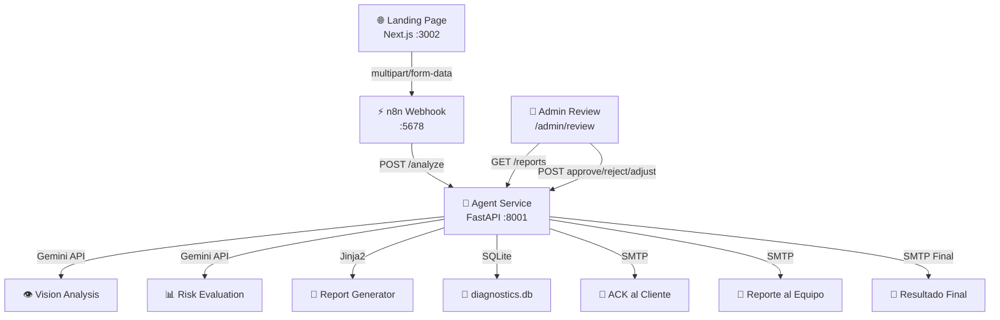

# 📘 SDD: SafetyMind Diagnostic Automation Suite (V4.3)

> Última actualización: 2026-05-07

## 1. Resumen Ejecutivo
El **Diagnostic Automation Suite (DAS)** es una plataforma de preventa técnica para Seguros Bolívar, diseñada para automatizar la evaluación de viabilidad de proyectos de videoanalítica. Utiliza IA (Gemini 2.0 Flash) y flujos orquestados (LangGraph) para analizar infraestructura y calidad de imagen.

## 2. Arquitectura del Sistema

## 3. Endpoints del API

| Método | Ruta | Descripción |
|--------|------|-------------|
| `GET` | `/health` | Estado del servicio |
| `POST` | `/analyze` | Recibe formulario completo (7 cámaras + infraestructura + riesgos) |
| `GET` | `/reports` | Lista todos los reportes para admin |
| `POST` | `/reports/{id}/approve` | Aprueba y envía reporte final al cliente |
| `POST` | `/reports/{id}/reject` | Rechaza el diagnóstico y notifica al cliente |
| `POST` | `/reports/{id}/adjust` | Solicita ajustes y notifica al cliente |

## 4. Flujo de Datos

1. **Ingesta**: Cliente completa Wizard de 3 pasos con datos de red y fotos de 7 cámaras.
2. **ACK Inmediato**: El backend envía correo de confirmación al cliente con SLA de 24h.
3. **Análisis IA (LangGraph)**:
   - **Nodo 1** – Visión: Evalúa resolución, enfoque, iluminación y cobertura por cámara.
   - **Nodo 2** – Riesgos: Cruza datos de infraestructura con scores de cámaras. Aplica reglas de negocio (semáforo).
   - **Nodo 3** – Reporte: Genera datos JSON para el template HTML.
4. **Persistencia**: Se guarda en SQLite con estado `PENDING`.
5. **HITL**: Técnico revisa en `/admin/review`. Decide: **Aprobar**, **Rechazar** o **Solicitar Ajustes**.
6. **Notificación Final**: Según decisión, se envía email con template apropiado al cliente.

## 5. Modelo de Datos (SQLite)

| Campo | Tipo | Descripción |
|-------|------|-------------|
| `id` | TEXT PK | ID del reporte (DAS-XXX-YYMMDD) |
| `client_name` | TEXT | Nombre de la empresa |
| `client_email` | TEXT | Correo del cliente |
| `verdict` | TEXT | VERDE / AMARILLO / ROJO |
| `viability_score` | INTEGER | 0-100 |
| `status` | TEXT | PENDING / APPROVED / REJECTED / ADJUSTMENTS_REQUIRED |
| `infrastructure` | TEXT (JSON) | Datos de VPN, servidor, condiciones |
| `camera_scores` | TEXT (JSON) | Scores individuales por cámara |
| `risk_factors` | TEXT (JSON) | Factores de riesgo seleccionados |
| `camera_photos` | TEXT (JSON) | Fotos en base64 |

## 6. Formulario del Cliente (Campos)

### Sección 1: Infraestructura
1. Cliente VPN (FortiClient / GlobalProtect / Cisco / Otra)
2. Distribución de cámaras (misma red / distintas redes)
3. Ubicación del servidor (Sala servidores / Sala eléctrica / Otro)
4. Refrigeración (Sí / No)
5. Operación 24/7 (Sí / No)
6. Iluminación nocturna (Sí / No)

### Sección 2: Cámaras (×7)
- Marca de la cámara
- Modelo de la cámara
- ¿Toma fija? (Sí / No)
- ¿Quién administra? (Informática interna / Seguridad / Proveedor externo / No sé)
- Factores de riesgo a detectar (EPP, Hombre-Máquina, Zonas Peligro, Cargas Suspendidas, Línea de Fuego, Condiciones Críticas)
- Fotografía de validación

## 7. Seguridad
- **CORS**: Permitido para todos los orígenes (fase desarrollo).
- **Admin Auth**: Código de acceso o Google Workspace.
- **SMTP**: Credenciales via variables de entorno.

---
© 2026 SafetyMind Engineering Division.
