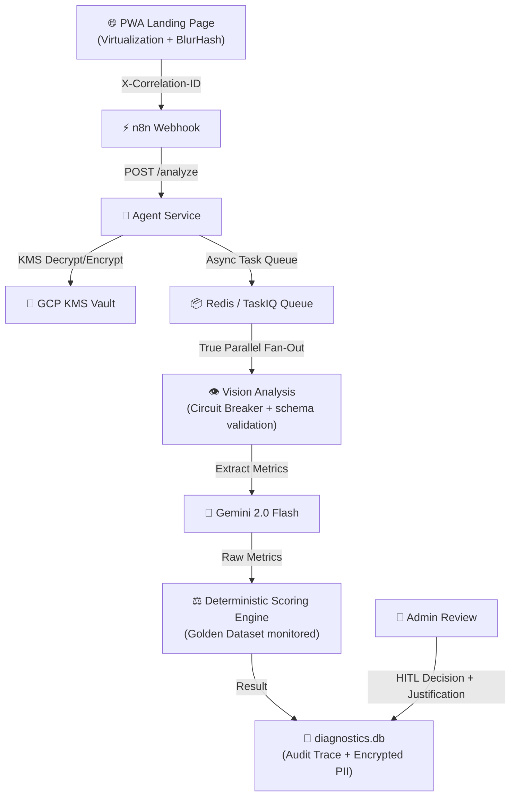

# 📘 SDD: SafetyMind Diagnostic Automation Suite (V4.3)

> Última actualización: 2026-05-19

## 1. Resumen Ejecutivo

El **Diagnostic Automation Suite (DAS)** es una plataforma semi-automatizada de preventa técnica para Seguros Bolívar. Permite a clientes realizar un "Autodiagnóstico de Viabilidad Técnica" antes de implementar el servicio de videoanalítica de SafetyMind.

**Metas principales (Arc42):**
1. Facilitar la recolección de información técnica de infraestructura del cliente (VPN, Servidor, Operación 24/7, Refrigeración, Iluminación).
2. Facilitar la subida de fotografías de validación (7 cámaras) para que la IA (Gemini 2.0 Flash) y/o un especialista técnico verifiquen la viabilidad del tamaño en píxeles y calidad de imagen.
3. Reducir la fricción en la cualificación de clientes, enviando un resultado tipo Semáforo (Verde, Amarillo, Rojo).
4. Proveer un SLA máximo de 1 día hábil para la respuesta.

## 2. Restricciones de Arquitectura (Arc42 - Galactic Edition)

| # | Restricción | Estado |
|---|-------------|--------|
| 1 | **Key Management:** Cifrado AES-256-GCM gestionado por **GCP KMS** para PII. | ✅ Secure |
| 2 | **API Resilience:** Circuit Breaker vía **tenacity** (3 retries + backoff) con Fallback Estático. | ✅ Resilient |
| 3 | **Scoring Logic:** Motor determinístico con pesos: Calidad (40%), Riesgo (35%), Infra (25%). | ✅ Stable |
| 4 | **Frontend Performance:** Virtualización con `react-window` y carga progresiva con BlurHash + PWA Shell. | ✅ Optimized |
| 5 | **Data Retention:** 30 días activo / 1 año archivo / Purga definitiva automática. | ✅ Compliant |
| 6 | **Idempotency:** UUIDv4 via `X-Idempotency-Key` con 60m TTL. | ✅ Robust |
| 7 | **Trazabilidad:** Header `X-Correlation-ID` obligatorio en toda la cadena. | ✅ Galactic |
| 8 | **Network Hardening:** CSP, HSTS y CORS Allow-List estrictos. | ✅ Hardened |

## 3. Arquitectura del Sistema (Galactic Grade)

## 4. Endpoints del API (Galactic Edition)

| Método | Ruta | Descripción |
|--------|------|-------------|
| `GET` | `/health` | Estado del servicio (incluyendo estado del KMS, Circuit Breaker y DB). |
| `POST` | `/analyze` | Inicia diagnóstico. Requiere `X-Idempotency-Key` y `X-Correlation-ID`. |
| `GET` | `/status/{job_id}` | Retorna estado. Maneja propagación de `X-Correlation-ID`. |
| `GET` | `/reports` | Lista reportes (descifrado JIT vía KMS para admin). |
| `POST` | `/reports/{id}/approve` | Requiere `justification` y `user_id` para el inmutable Audit Trace. |

## 5. Flujo de Datos (Galactic Resilience)

### 5.1 Trazabilidad & PII
1. El backend valida el `X-Idempotency-Key` y propaga el `X-Correlation-ID` a todos los sub-procesos.
2. Los datos identificables se cifran mediante **AES-256-GCM** solicitando la llave al **GCP KMS**.
3. El frontend funciona como **PWA**, permitiendo carga de la shell en zonas de baja conectividad.

### 5.2 Procesamiento Determinístico & Drift
1. LangGraph invoca múltiples nodos de visión simultáneamente. Todo output se valida contra esquemas **Pydantic**.
2. El sistema se somete a un **Self-Audit mensual** contra un **Golden Dataset** para detectar deriva en la precisión de la IA.
3. El veredicto final se calcula mediante pesos estáticos, usando unidades **SI (Sistema Internacional)** exclusivamente.

### 5.3 Disaster Recovery & Retention
1. Respaldo diario del SQLite cifrado en almacenamiento WORM (Write Once Read Many).
2. **RPO (Recovery Point Objective)** de 24 horas.
3. Simulación trimestral de restauración de datos y llaves KMS.

## 6. Modelo de Datos (Galactic Forensic)

### Tabla `reports` (Secure)
| Campo | Tipo | Descripción |
|-------|------|-------------|
| `id` | TEXT PK | Job ID / UUID |
| `correlation_id` | TEXT | ID de trazabilidad forense |
| `idempotency_key` | TEXT | Llave de control de duplicados |
| `client_name_enc` | BLOB | PII Cifrada (GCP KMS) |
| `ai_metadata` | TEXT | JSON validado con Pydantic |

### Tabla `audit_traces` (Inmutable)
| Campo | Tipo | Descripción |
|-------|------|-------------|
| `operator_id` | TEXT | Identificador del técnico |
| `action_type` | TEXT | APPROVE / OVERRIDE / REJECT |
| `forensic_justification` | TEXT | **Mandatorio.** Razón técnica del cambio. |

## 8. Seguridad y Cumplimiento

- **Network Hardening:** Implementación de **CSP**, **HSTS** y CORS Allow-List corporativo.
- **Zero-Tolerance Hallucination:** Prohibido inventar datos. Errores de API fuerzan `REVISION_MANUAL`.
- **Localization:** Soporte i18n para terminología industrial específica y reportes localizados.

---

© 2026 SafetyMind Engineering Division. Alineado con Arc42, ISO 27001 e i18n standards.
